# Phishing-Simulation-with-GoPhish

A hands-on phishing simulation lab using GoPhish on Kali Linux to demonstrate social engineering techniques, credential harvesting, email tracking, campaign execution, and results analysis in a controlled environment.

## Project Overview

- **Objective** : Execute a complete phishing simulation using GoPhish to showcase offensive security tooling, phishing campaign setup, and post-execution analysis for authorized red teaming or security awareness training.
- **Duration** : Completed in one session (full walkthrough documented here).
- **Tools/Environment** : Windows host machine, Kali Linux VM (bridged networking — same IP subnet as host), GoPhish phishing framework, Gmail SMTP (with App Password), Firefox/Chrome on Kali for interface, Snipping Tool on Windows for screenshots.
- **Repo Structure**:
  - `screenshots/` : Step-by-step visuals of GoPhish interface, configurations, and results (organized by phase: 01_launch-and-login, 02_sending-profile, etc.).

- **Progress** : Simulation fully completed (launch → sending profile → landing page → email template → target group → campaign launch & results).

## Simulation Setup Facts

| Aspect                  | Instruments / Details                              | Implementation / Notes                                                                 |
|-------------------------|----------------------------------------------------|----------------------------------------------------------------------------------------|
| Virtualization          | VMware / VirtualBox / Hyper-V                      | Kali Linux VM in bridge mode (same subnet as Windows host)                             |
| Network                 | Bridged adapter                                    | Kali IP (e.g., 192.168.x.x) used as phishing listener base URL                         |
| GoPhish Admin Interface | https://localhost:3333 (on Kali)                   | Self-signed certificate accepted; default credentials shown in terminal                |
| Phishing Listener       | http://<KALI_IP>:80                                | Campaign URL base (e.g., http://10.145.142.93); port 80 open or forwarded if needed    |
| Sending Profile         | Gmail SMTP (smtp.gmail.com:587 or 465, TLS/STARTTLS) | App Password required (normal password blocked by Google)                              |
| Target Group            | Manual entry (single test recipient)               | Self-owned email account only — no real users targeted                                 |
| Screenshot Capture      | Windows Snipping Tool (Win+Shift+S)                | Captured Kali VM screen; saved directly into repo folders                              |

## Full Simulation Walkthrough

Accessed GoPhish on Kali Linux VM via terminal launch and browser interface.

### Detailed Steps and Commands

1. **Launch & Secure GoPhish**  
   - Started GoPhish binary (via terminal or application menu).  
   - Viewed initial admin credentials printed in console.  
   - Opened browser on Kali → https://localhost:3333 → accepted self-signed cert.  
   - Logged in with default credentials → immediately changed password for security.  

   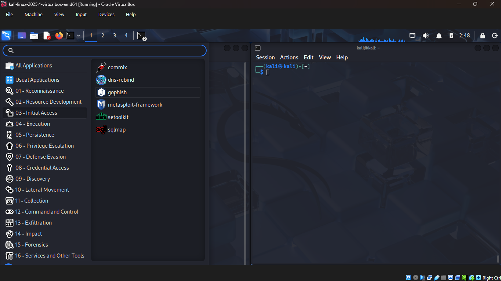  
   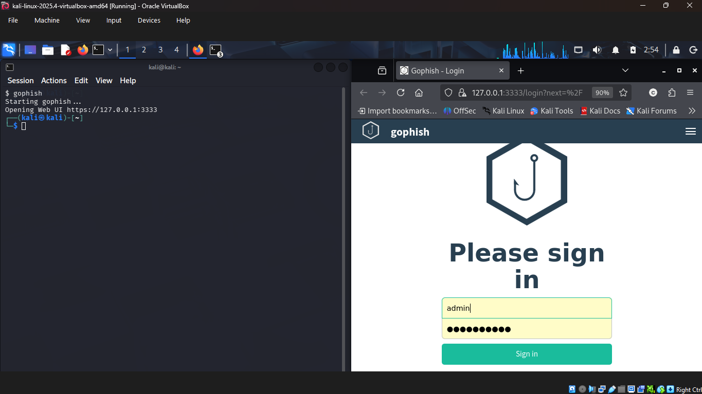

2. **Sending Profile Configuration**  
   - Navigated to Sending Profiles → New Profile.  
   - Configured Gmail SMTP server: smtp.gmail.com, port 587 (or 465), STARTTLS/TLS, username + App Password.  
   - Saved profile → sent test email to self.  
   - Verified delivery in inbox (including SPF/DKIM headers if applicable).  

   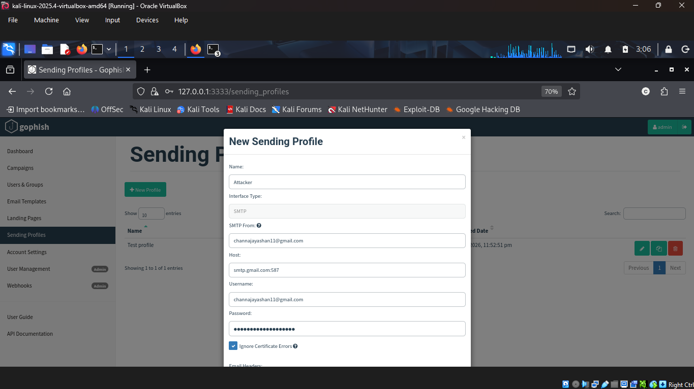  
   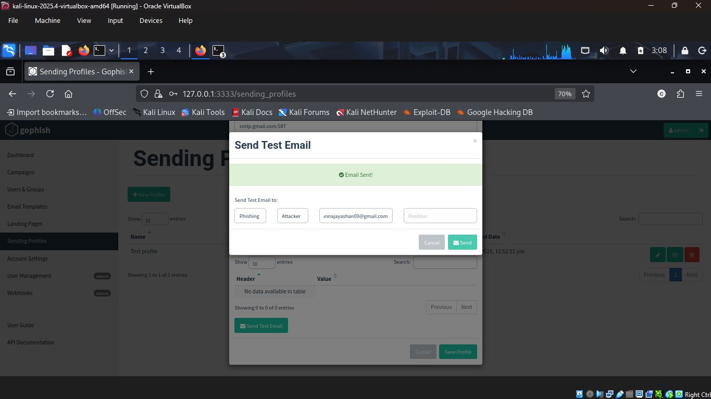  
   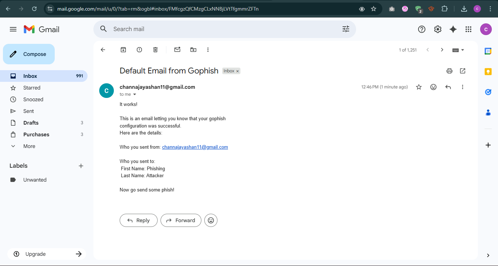

3. **Landing Page Creation**  
   - Created new landing page → imported HTML source from legitimate site (e.g., Google login clone).  
   - Enabled "Capture Submitted Data" and "Capture Passwords".  
   - Set redirect URL to https://myaccount.google.com/ 
   - Saved and verified page preview.  

   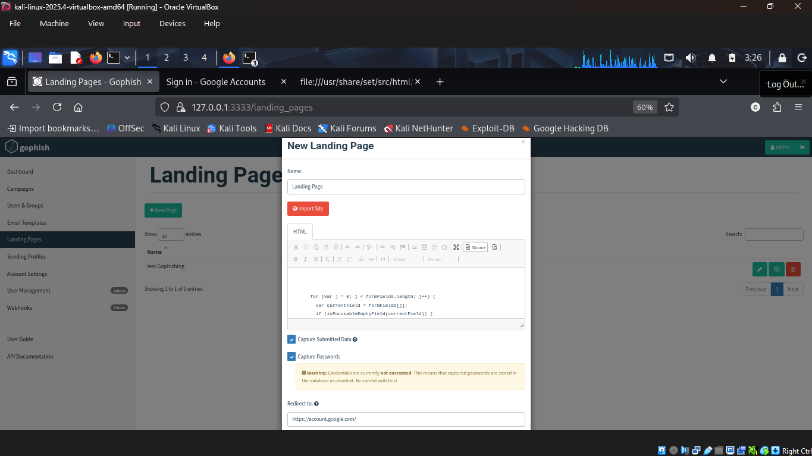

4. **Email Template Setup**  
   - Created new template → imported raw email source (full MIME/headers + body).  
   - Used "Change Links" feature to automatically redirect all URLs to phishing landing page.  
   - Added tracking image (pixel) for email open detection.  
   - Previewed template and saved.  

   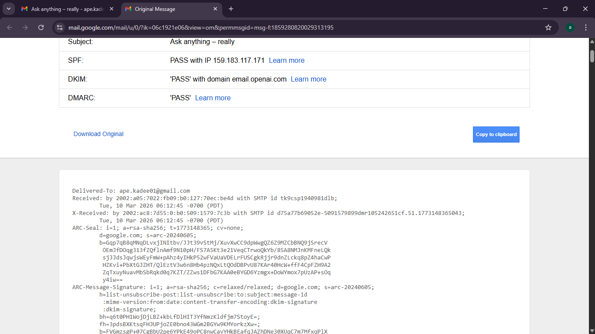  
   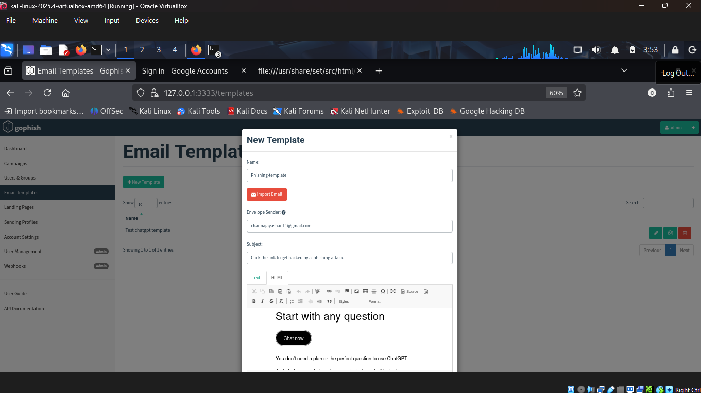

5. **Users & Groups Definition**  
   - Created new group.  
   - Added single test recipient (name + self-owned email address).  
   - Saved group.  

   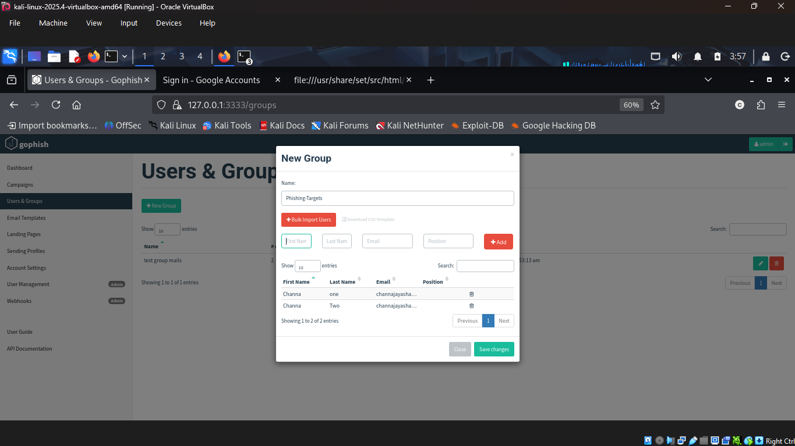

6. **Campaign Launch & Results Analysis**  
   - Created new campaign → selected email template, landing page, sending profile, and target group.  
   - Set URL base to http://<KALI_IP> (phishing server listener).  
   - Launched campaign → monitored real-time progress.  
   - Observed email sent → opened → link clicked → credentials submitted.  
   - Viewed captured credentials, timeline, and full events.  

   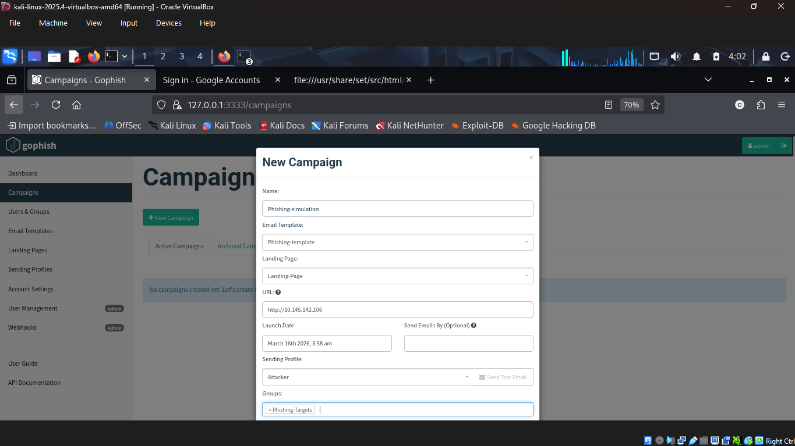
   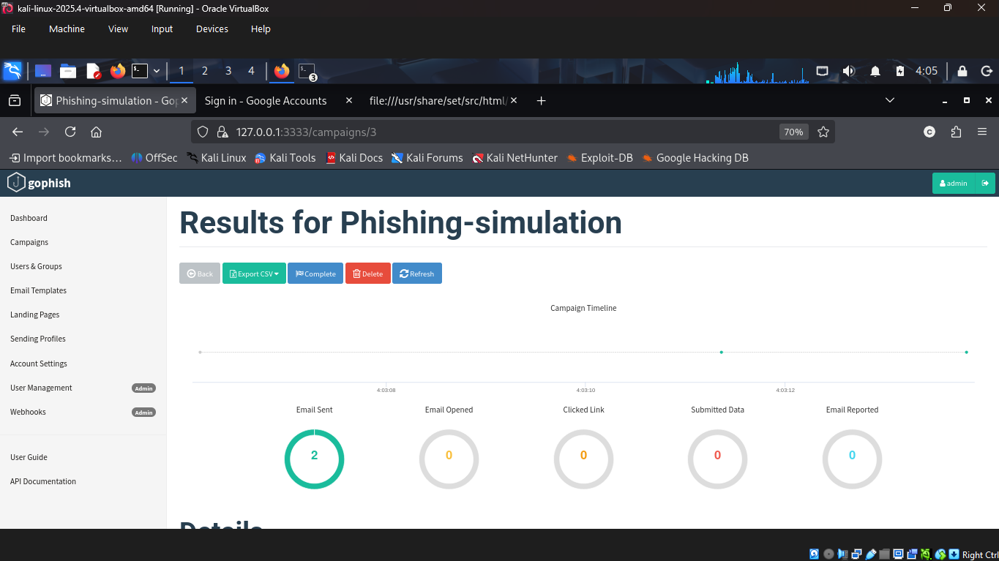  
   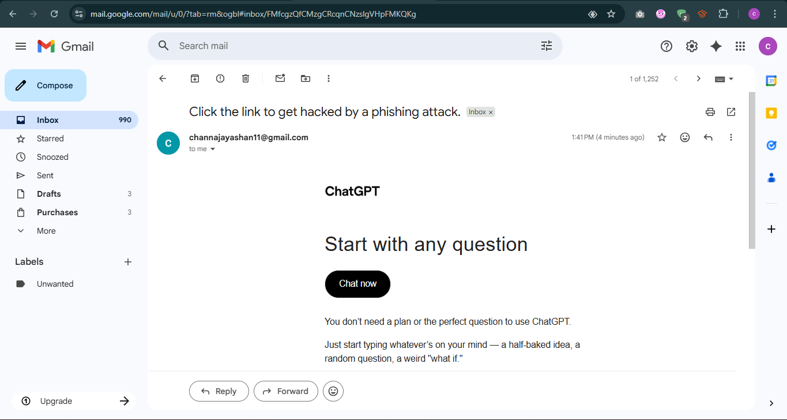  
   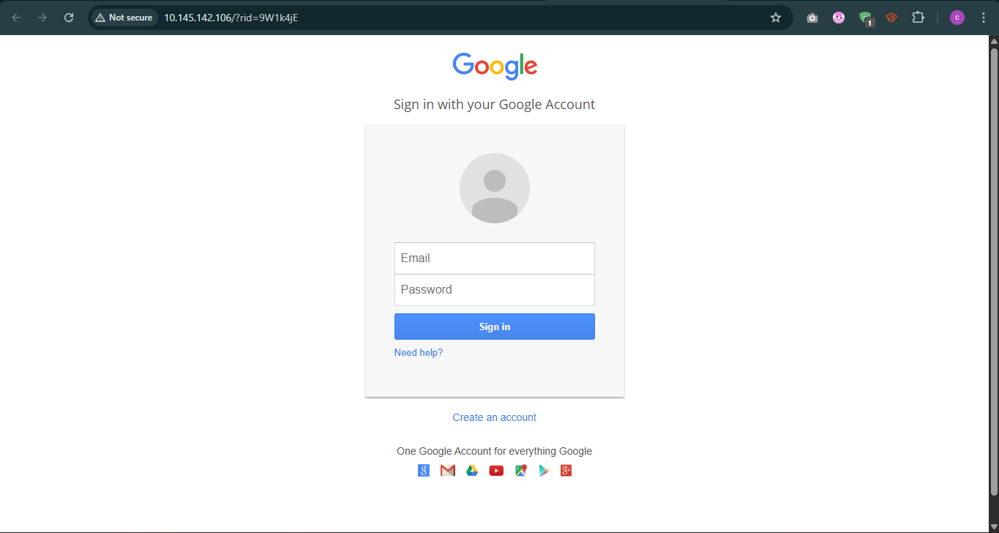
   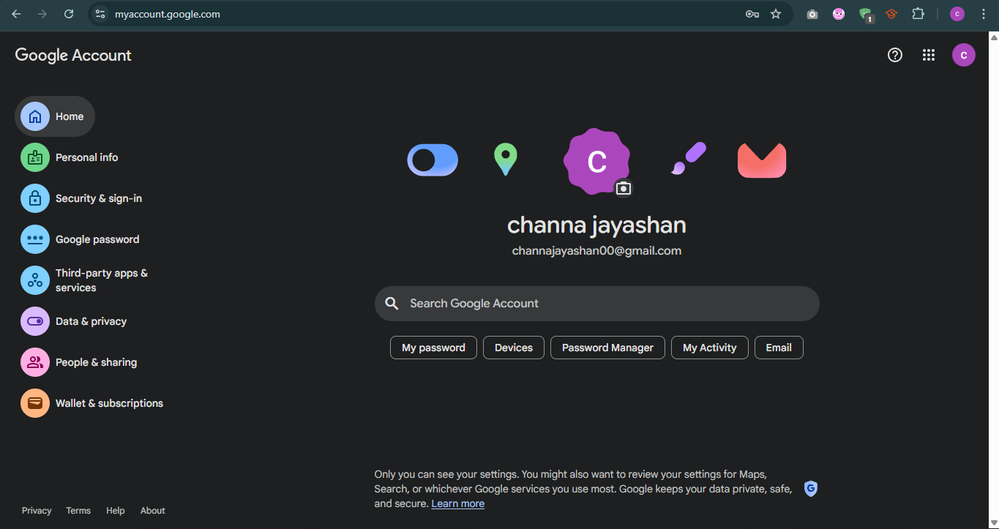
   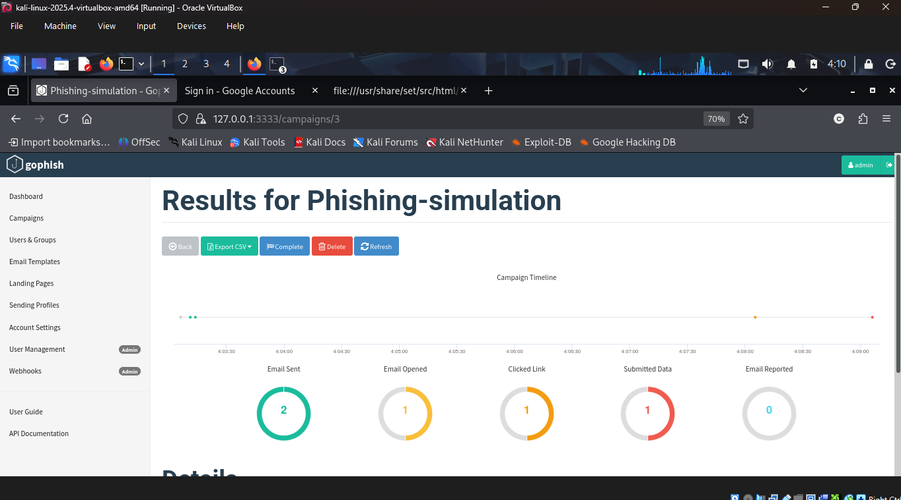  
   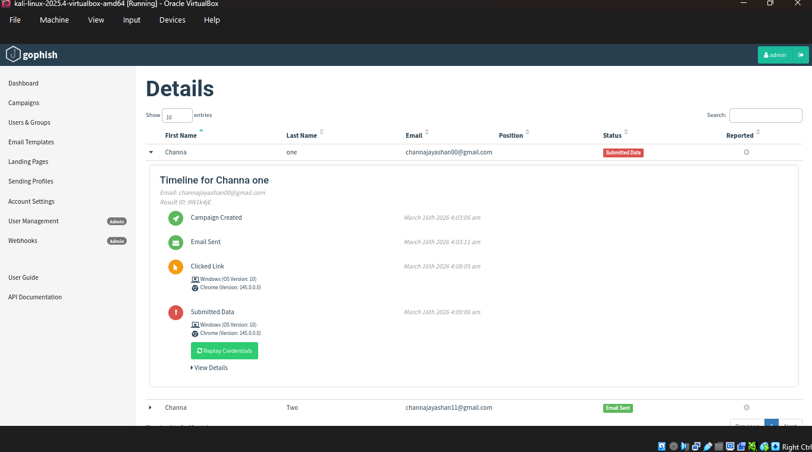    
   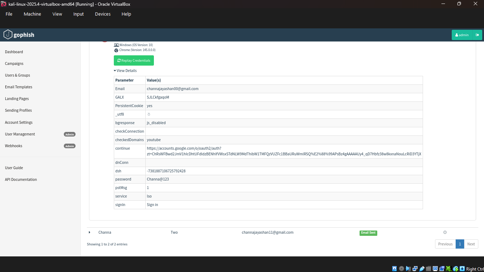  
   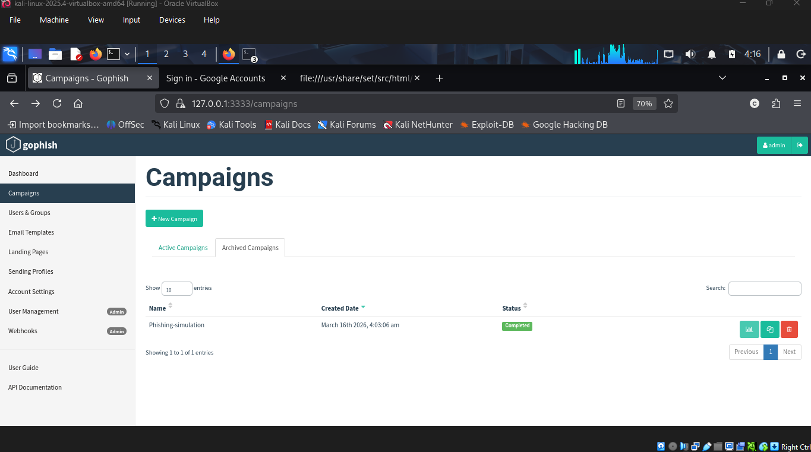

### Troubleshooting and Notes

- **Gmail authentication failure** — Normal password blocked; resolved by generating and using App Password from Google Account settings.
- **Listener / port binding issues** — If http://<KALI_IP>:80 not reachable from host/browser, checked firewall (ufw allow 80), GoPhish flags (--phish-listen=0.0.0.0:80), or bridge mode connectivity.
- **Self-signed cert warning** — Browser accepted manually for admin interface (localhost only).
- **No major network/firewall blocks** — Bridge mode allowed smooth host-to-guest and external email delivery. Any errors would be saved in `errors-faced/`.
- **Ethical & legal reminder** — Simulation used exclusively self-controlled test accounts. Never target real users without explicit authorization.

Full simulation captured via screenshots; no external logs needed for this single-session lab.

Resources Used: Official GoPhish documentation (gophish.com), Gmail App Password guide.

## License

MIT License (see LICENSE file if added; otherwise consider adding one for open sharing).